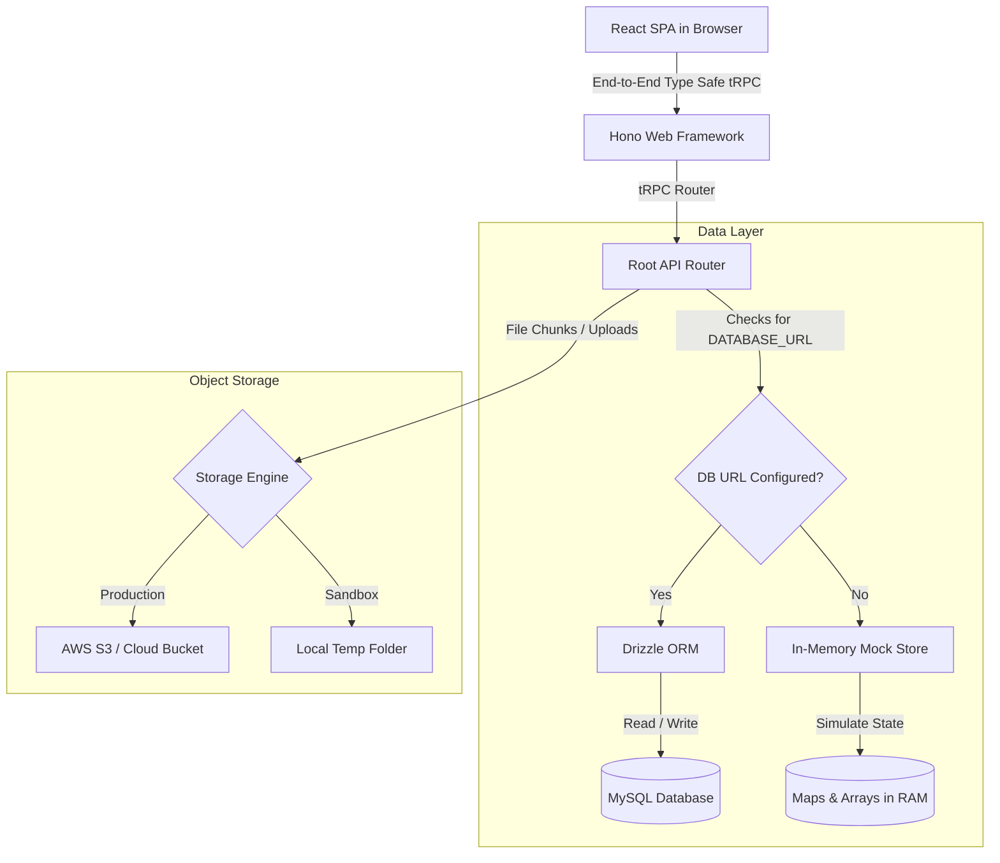
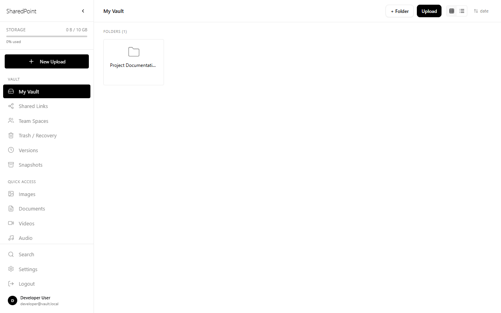
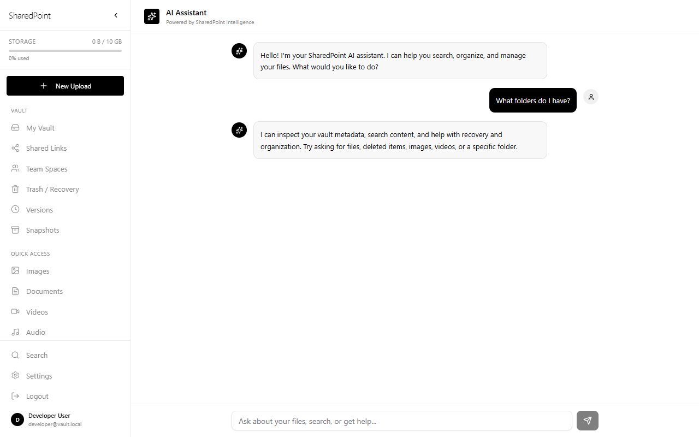

# SharedPoint — Permanent Secure Storage

SharedPoint is a secure, collaborative, and permanent digital vault system. It allows users and teams to upload files of any size, version them, establish point-in-time restore states, share files with security constraints (passwords, expiry limits, download counts), and manage team collaborations inside isolated workspaces.

---

## 🌟 Key Concept: The Dual-Path Design

SharedPoint features a **Dual-Path State engine**. This means the application can operate in two modes depending on its configuration:

1. **Cloud & Production Mode (MySQL + S3)**: If a `DATABASE_URL` is set, the application persists metadata to a relational MySQL database via Drizzle ORM and handles file operations through cloud storage.
2. **Offline Sandbox Mode (In-Memory)**: If `DATABASE_URL` is missing, the application redirects all tRPC database procedures to an in-memory data store ([local-auth-store.ts](file:///e:/SharedPoint_%20Permanent%20Secure%20Storage/app/api/queries/local-auth-store.ts) and [local-content-store.ts](file:///e:/SharedPoint_%20Permanent%20Secure%20Storage/app/api/queries/local-content-store.ts)). This lets you develop, test, and run the entire system instantly without installing a database!

---

## 🏗️ Architecture & System Design

SharedPoint uses a hybrid model where a Vite-powered React single page application and a Node.js Hono API server run in a unified process.

### System Architecture Flow



---

## 📁 Project Directory Structure

```filepath
├── app/
│   ├── api/                     # Hono backend and tRPC routers
│   │   ├── dev/                 # Dev utilities & workflow runners
│   │   ├── kimi/                # OAuth callback & login setup
│   │   ├── lib/                 # Env validator, cookies, and HTTP wrappers
│   │   ├── queries/             # DB queries & mock store fallbacks
│   │   ├── routers/             # Business logic controllers (Vault, Upload, Share...)
│   │   └── boot.ts              # Server bootstrapper (combines SPA & API)
│   ├── contracts/               # Shared TS contracts & constants
│   ├── db/                      # Database structure & migrations
│   │   └── schema.ts            # Drizzle ORM table definitions
│   ├── src/                     # React frontend (Vite)
│   │   ├── components/          # Reusable UI & Layouts
│   │   ├── hooks/               # Custom React hooks (e.g. useAuth)
│   │   ├── pages/               # Views (Vault, Spaces, Admin, AI Assistant...)
│   │   └── App.tsx              # React router routing definitions
│   ├── package.json             # App dependencies & run scripts
│   └── vite.config.ts           # Vite server & backend proxy config
└── README.md                    # Main documentation (this file)
```

---

## 🚀 Key Features & Interface Mockups

### 🔒 Secure Storage Vault
Manage folders and documents through a sleek, unified catalog. Features list/grid views, metadata filtering, drag-and-drop movement, and a 30-day trash retention recovery.



### 📦 Chunked Large-File Uploads
Supports files of any size by slicing them into 5MB chunks on the client side. Includes real-time progress bars, upload speed indicators, and pause/resume/cancel controls.

### 🤖 Intelligent AI Assistant
Conversational chat UI that hooks into client tRPC requests. Instantly query your metadata: search files, list active media (images/videos), retrieve recently deleted items, or locate items in specific directories.



### 🤝 Team Workspaces
Isolated shared spaces built for organization-level projects. Invite members, assign permissions (`manager`, `editor`, `viewer`, `guest`), transfer ownership, and view real-time activity streams.

### 🔗 Link Sharing & Recovery Control
Generate tokenized sharing URLs protected by passwords, download count limits, and custom expiration dates. Restores are simple through soft-delete tracking.

### 💾 Point-in-Time Snapshots
Create instant snapshots of your folder hierarchy and file states to act as recovery checkpoints. Restore files back to any historical version easily.

---

## 🔧 Installation & Setup

Follow these steps to run SharedPoint locally:

### 1. Prerequisite
Ensure you have **Node.js (version 20 or higher)** installed.

### 2. Install Dependencies
Navigate to the `app` directory and install the packages:
```bash
cd app
npm install
```

### 3. Environment Setup
Copy the example environment configuration:
```bash
cp .env.example .env
```
Fill in the variables in `.env`. If you just want to run in **In-Memory Sandbox Mode**, you can leave `DATABASE_URL` empty.

### 4. Running the Dev Server
Launch Vite (which hot-reloads both your React frontend and Hono backend):
```bash
npm run dev
```
Open **`http://localhost:3001`** in your browser.

---

## 🛠️ DB Migrations (For Cloud Mode Only)
If you configure a real MySQL connection via `DATABASE_URL`, execute the schema creation commands:
* **Generate Schema**: `npm run db:generate`
* **Push Schema to DB**: `npm run db:push`
* **Migrate DB**: `npm run db:migrate`
